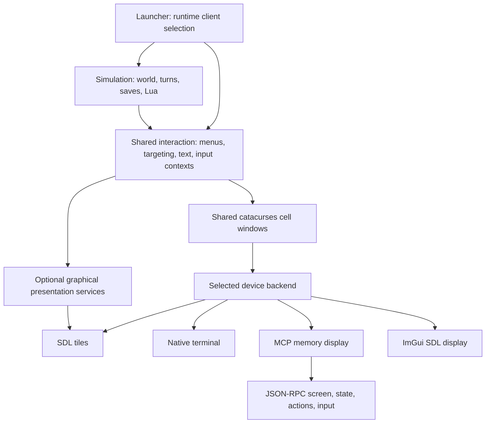

BN compiles its simulation and shared interaction code once. A single `cataclysm-bn` executable links the enabled clients and selects one at startup:

```sh
cmake --preset linux-clients
cmake --build --preset linux-clients --target cataclysm-bn
out/build/linux-clients/src/cataclysm-bn --client=tiles
out/build/linux-clients/src/cataclysm-bn --client=curses
out/build/linux-clients/src/cataclysm-bn --client=mcp
```

`TILES`, `CURSES`, and `MCP` control which standard backends are included. `IMGUI=ON` adds the optional Dear ImGui backend. `--client` selects the backend to run. The default prefers tiles, then curses, then ImGui, then MCP. Compatibility executable names select their corresponding client unless `--client` overrides them.

### ImGui proof client

The optional ImGui client presents the shared composed screen beside registered actions and a structured state summary. It is intended for backend development rather than as a replacement for the Tiles UI.

```sh
cmake --preset linux-clients -DIMGUI=ON
cmake --build --preset linux-clients --target cataclysm-bn-imgui
out/build/linux-clients/src/cataclysm-bn-imgui \
  --userdir out/imgui-profile/ --configdir out/imgui-profile/config/
```

Append `--paths` first and verify that `Config Directory` resolves inside the profile. Use the keyboard in the composed screen, select a registered action, or enter text in the control pane. Controls are enabled only while the game is waiting at the displayed input boundary. ImGui layout settings are not persisted.

This backend is an alternate-client proof, not a tiles renderer. It exposes the composed screen, live actions, text input, and a concise player/inventory view, but does not yet expose every menu choice, field, or target as a structured widget. Structured choices use bounded 100-entry pages with previous/next controls and visible offset and total counts. A quantity update retains the current page; a changed, filtered, reordered, or shortened choice schema resets or clamps it before rendering.

## Dependency boundaries



`cataclysm-bn-engine` contains simulation and data processing. `cataclysm-bn-client-common` contains the shared interaction and presentation code: character creation, inventory, targeting, menus, window composition, and the game view. Both are compiled once, regardless of the number of enabled backends. Input contexts, choices, and screen contents are the common interaction contract.

The boundary is in-process. Gameplay flows can request choices through shared interaction interfaces; they do not own the native display or its resources. MCP adds a protocol client to this existing interaction path.

`catacurses::window` has one representation: a `cata_cursesport::WINDOW` containing UTF-8 cells and colors. Window creation, text layout, borders, and cursor state are common code. `game_client::backend` supplies native input, presentation, terminal geometry, and lifecycle operations. The ncurses backend projects the cell windows into a native terminal; the SDL backend retains tile rendering for map and graphical windows; MCP observes the text presentation.

`game_client::render_service` contains optional graphical operations such as clipboard access, font projection, clipping, zoom, tileset management, and screenshots. Graphical character and vehicle previews and loading images have separate resource-owning implementations. Shared gameplay and menu translation units use these interfaces without including SDL renderer types or compiling a second version under `TILES`. Native rendering implementations live in the tiles source bucket, including `src/client/tiles/`.

`src/main.cpp` owns argument handling and the game session loop. Native entry points, platform paths, signal handling, and SDL initialization live in `src/platform/`. Backend registration is explicit, so disabled backends introduce no unresolved factory references. A backend is prepared before options and initialized after locale and configuration are ready.

Shared class declarations have the same layout in every target. Keep native resources behind interfaces with out-of-line destruction. Client build definitions belong to their native implementation targets.

Audio playback is compiled once in the audio target. Acoustic propagation and the effects of noise on creatures remain in the engine. GPU computation is a simulation service independent of display selection. Curses and MCP can initialize SDL computation through an offscreen video driver. A standalone CPU-only MCP build can use `MCP=ON`, `TILES=OFF`, `CURSES=OFF`, `SOUND=OFF`, and `CATA_SDL=OFF`.

## Input and observation

All clients run the same game loop and `input_context` logic. MCP sends keyboard, text, mouse, and registered-action events through that path. Nested prompts during activities, dialogue, inventory, and character creation remain observable and controllable.

`game_client::active_input_context()` is scoped to an input request. Nested requests restore their enclosing context on return or exception. The shared `client_command` service discovers actions and resolves keyboard, text, and mouse commands independently of MCP. Every shared input read gets an `input_id`; commands carrying an older identity are rejected before execution. `game_observation` supplies player-visible state without depending on a transport or renderer.

Input, rendering, and state observation run on the game thread, so a snapshot is captured at a stable input boundary. `bn.press` completes after its queued inputs have reached the next input boundary. The active input view includes the polling timeout, allowing the shared command resolver to accept `IDLE` only for a nonblocking poll. [Recording and playback](../guides/replay.md) also intercept this shared boundary, rather than maintaining separate hooks in each native backend. Replay recording and playback poll interruptible activities at each simulation call boundary; ordinary native play retains the 100 ms wall-clock throttle.

The current semantic slice exposes startup root/submenus, `uilist`, ordinary choice, confirmation, and acknowledgement popups, `string_input_popup` fields, filtered actionable entries from common inventory selectors, the common targeting cursor, common direction prompts, and construction. Snapshots carry opaque IDs and are tied to the current input boundary and schema. Choice selection and navigation focus are separate: inventory multiselectors report chosen counts as selected, while a single picker's current row is highlighted but not selected before it closes. Inventory single-pick and representative drop, pickup, and item-use quantity workflows call the existing selector callbacks; compare quantities remain unsupported. Target commands only move the existing cursor, while aim, fire, throw, and safety confirmation continue through registered actions and nested prompts. The crafting selector exposes its native recipe order, availability, filter flow, and batch state; confirmation still uses native component and eligibility checks. Construction exposes the live filtered project order and uses native confirmation, adjacent placement, resource, and activity paths. The ground pickup view exposes its filtered stacks, exact charge or item counts, and parent/child state while retaining native toggle propagation, pickup activities, wear/wield checks, and capacity or ownership prompts. Advanced inventory publishes live panes and focus-only selections while native transfer actions retain their quantity and safety prompts. Dialogue responses, Help topics, and read-only text readers are also structured. `MORALE` publishes its complete native text and closes through semantic cancellation. Vehicle interaction, character creation, and other custom views remain explicit `actions_only` fallbacks.

The [MCP guide](../guides/mcp.md) documents the screen, structured state, input schema, and observation coverage. Session readiness is a backend-neutral flag set by the launcher after world and character setup. Structured state is unavailable during startup and character creation; their screens and input contexts remain available.

To add a client, implement the device interface, register its factory, and add its native sources to `CataClientSources.cmake`. Provide graphical services only for capabilities the client supports. Reuse the shared interaction code and window representation.

## Related work

- [Structured state and screen output proposal #9184](https://github.com/cataclysmbn/Cataclysm-BN/issues/9184) describes the limitations of terminal scraping. MCP captures the existing memory surface at input boundaries so nested prompts are observable as well as turns.
- [Deterministic input replay #9478](https://github.com/cataclysmbn/Cataclysm-BN/pull/9478) provides the RNG/task-scoping foundation for the integrated replay feature.
- [Headless curses SDL initialization](https://github.com/scarf005/Cataclysm-BN/commit/562fa8564091) addresses the display requirements of SDL compute support. MCP supplies its own memory display backend.
