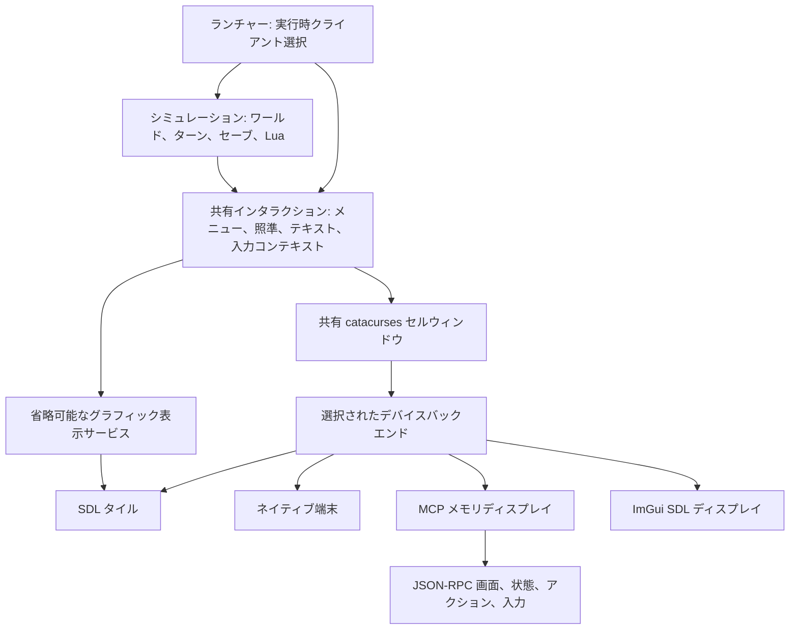

BN はシミュレーションと共有インタラクションコードを一度だけコンパイルします。単一の `cataclysm-bn` 実行ファイルが有効なクライアントをリンクし、起動時に一つを選択します。

```sh
cmake --preset linux-clients
cmake --build --preset linux-clients --target cataclysm-bn
out/build/linux-clients/src/cataclysm-bn --client=tiles
out/build/linux-clients/src/cataclysm-bn --client=curses
out/build/linux-clients/src/cataclysm-bn --client=mcp
```

`TILES`、`CURSES`、`MCP` は、組み込む標準バックエンドを制御します。`IMGUI=ON` は省略可能な Dear ImGui バックエンドを追加します。`--client` は実行するバックエンドを選択します。既定ではタイル、curses、ImGui、MCP の順で優先されます。互換実行ファイル名は、`--client` で上書きしない限り対応するクライアントを選択します。

### ImGui 実証用クライアント

省略可能な ImGui クライアントは、共有の合成画面を登録済みアクションおよび構造化された状態の概要と並べて表示します。タイル UI の代替ではなく、バックエンド開発を目的としています。

```sh
cmake --preset linux-clients -DIMGUI=ON
cmake --build --preset linux-clients --target cataclysm-bn-imgui
out/build/linux-clients/src/cataclysm-bn-imgui \
  --userdir out/imgui-profile/ --configdir out/imgui-profile/config/
```

まず `--paths` を追加し、`Config Directory` がプロファイル内のパスとして解決されることを確認してください。合成画面でキーボードを使うか、登録済みアクションを選択するか、コントロールペインにテキストを入力できます。ゲームが表示中の入力境界で待機している間だけコントロールが有効になります。ImGui のレイアウト設定は永続化されません。

このバックエンドはタイルレンダラーではなく、代替クライアントの実証実装です。合成画面、ライブアクション、テキスト入力、簡潔なプレイヤー/所持品ビューを公開しますが、まだすべてのメニュー選択肢、フィールド、対象を構造化ウィジェットとして公開するわけではありません。構造化された選択肢は、前へ/次へボタンと現在のオフセットおよび総数を持つ、最大 100 項目のページで表示されます。数量の更新では現在ページを維持し、選択肢のスキーマが変更、フィルター、並べ替え、短縮された場合は、描画前にページをリセットまたは範囲内へ補正します。

## 依存関係の境界



`cataclysm-bn-engine` にはシミュレーションとデータ処理が含まれます。`cataclysm-bn-client-common` には、キャラクター作成、所持品、照準、メニュー、ウィンドウ合成、ゲームビューといった共有インタラクションおよび表示コードが含まれます。有効なバックエンドの数にかかわらず、どちらも一度だけコンパイルされます。入力コンテキスト、選択肢、画面内容が共通のインタラクション規約です。

この境界はプロセス内にあります。ゲームプレイフローは共有インタラクションインターフェースを通じて選択を要求でき、ネイティブディスプレイやそのリソースを所有しません。MCP はこの既存のインタラクション経路にプロトコルクライアントを追加します。

`catacurses::window` の表現は、UTF-8 セルと色を保持する `cata_cursesport::WINDOW` の一つだけです。ウィンドウ作成、テキスト配置、境界線、カーソル状態は共通コードです。`game_client::backend` はネイティブ入力、表示、端末サイズ、ライフサイクル操作を提供します。ncurses バックエンドはセルウィンドウをネイティブ端末へ投影し、SDL バックエンドはマップとグラフィックウィンドウのタイル描画を維持し、MCP はテキスト表示を観察します。

`game_client::render_service` には、クリップボードアクセス、フォント投影、クリッピング、ズーム、タイルセット管理、スクリーンショットなどの省略可能なグラフィック操作が含まれます。グラフィックでのキャラクター/車両プレビューと読み込み画像には、それぞれリソースを所有する実装があります。共有ゲームプレイとメニューの翻訳単位は、SDL レンダラー型をインクルードしたり `TILES` 条件で二つ目の版をコンパイルしたりせず、このインターフェースを使います。ネイティブ描画実装は `src/client/tiles/` を含むタイルソース群にあります。

`src/main.cpp` は引数処理とゲームセッションループを所有します。ネイティブエントリーポイント、プラットフォームパス、シグナル処理、SDL 初期化は `src/platform/` にあります。バックエンド登録は明示的なので、無効なバックエンドによって未解決のファクトリー参照が生じることはありません。バックエンドはオプション処理の前に準備され、ロケールと設定の準備後に初期化されます。

共有クラス宣言はすべてのターゲットで同じレイアウトを持ちます。ネイティブリソースはインターフェースの背後に置き、デストラクターはソースファイル側で定義してください。クライアントのビルド定義は、そのネイティブ実装ターゲットに属します。

音声再生は音声ターゲットで一度だけコンパイルされます。音響の伝播と騒音がクリーチャーへ及ぼす効果はエンジンに残ります。GPU 計算はディスプレイ選択から独立したシミュレーションサービスです。Curses と MCP はオフスクリーン動画ドライバーを介して SDL 計算を初期化できます。独立した CPU 専用 MCP ビルドでは `MCP=ON`、`TILES=OFF`、`CURSES=OFF`、`SOUND=OFF`、`CATA_SDL=OFF` を使用できます。

## 入力と観察

すべてのクライアントは同じゲームループと `input_context` ロジックを実行します。MCP はキーボード、テキスト、マウス、登録済みアクションのイベントをこの経路へ送ります。活動、会話、所持品、キャラクター作成中のネストしたプロンプトも引き続き観察および操作できます。

`game_client::active_input_context()` のスコープは一つの入力要求です。ネストした要求は、復帰時または例外発生時に外側のコンテキストを復元します。共有 `client_command` サービスは MCP と独立してアクションを検出し、キーボード、テキスト、マウスのコマンドを解決します。共有入力の読み取りには毎回 `input_id` が付与され、古い ID を持つコマンドは実行前に拒否されます。`game_observation` は転送方式やレンダラーに依存せず、プレイヤーから見える状態を提供します。

入力、描画、状態観察はゲームスレッドで実行されるため、安定した入力境界でスナップショットが取得されます。`bn.press` はキューに入れた入力が次の入力境界へ到達した後に完了します。アクティブな入力ビューにはポーリングのタイムアウトが含まれるため、共有コマンド解決器は非ブロッキングポーリングでのみ `IDLE` を受け付けます。[入力の記録と再生](../guides/replay.md)も、各ネイティブバックエンドに別々のフックを持つのではなく、この共有境界を横断します。リプレイの記録と再生では、各シミュレーション呼び出し境界で中断可能な活動をポーリングします。通常のネイティブプレイでは、実時間 100 ms のスロットルを維持します。

現在のセマンティック対応範囲は、起動時のルート/サブメニュー、`uilist`、通常の選択/確認/通知ポップアップ、`string_input_popup` フィールド、共通の所持品セレクターでフィルターされた操作可能な項目、共通の照準カーソル、共通の方向プロンプト、および建設です。スナップショットは不透明 ID を持ち、現在の入力境界とスキーマに結び付けられます。選択状態とナビゲーションフォーカスは別です。所持品の複数選択では選択数を選択状態として報告し、単一項目ピッカーでは閉じる前の現在行を選択済みではなくハイライトとして報告します。所持品の単一選択と、代表的なドロップ、拾得、アイテム使用の数量ワークフローは既存セレクターのコールバックを呼び出しますが、比較の数量には対応していません。対象コマンドは既存カーソルを動かすだけで、照準、射撃、投擲、安全確認は登録済みアクションとネストしたプロンプトを通ります。製作レシピセレクターはネイティブのレシピ順、製作可能状態、フィルター処理、バッチ状態を公開し、確認には引き続きネイティブの材料・適格性検査を使います。建設は現在のフィルター済みプロジェクト順を公開し、ネイティブの確認、隣接配置、資材、活動の経路を使います。地面の拾得ビューは、フィルター後のスタック、正確なチャージ数または個数、親子状態を公開しつつ、ネイティブのトグル伝播、拾得活動、着用/装備の検査、容量または所有権のプロンプトを維持します。高度な所持品管理は現在のペインとフォーカスのみを変更する選択を公開し、ネイティブの移動アクションは数量と安全確認のプロンプトを維持します。会話の応答、ヘルプのトピック、読み取り専用のテキストビューも構造化されています。`MORALE` はネイティブ表示の全文を公開し、セマンティックなキャンセルで閉じます。車両操作、キャラクター作成、その他のカスタムビューは、明示的な `actions_only` フォールバックのままです。

[MCP ガイド](../guides/mcp.md)では画面、構造化された状態、入力スキーマ、観察範囲を説明しています。セッション準備状態は、ワールドとキャラクターの設定後にランチャーが設定するバックエンド中立のフラグです。起動中とキャラクター作成中は構造化された状態を利用できませんが、それらの画面と入力コンテキストは引き続き利用できます。

クライアントを追加するには、デバイスインターフェースを実装し、そのファクトリーを登録して、ネイティブソースを `CataClientSources.cmake` に追加してください。クライアントが対応する機能にだけグラフィックサービスを提供してください。共有インタラクションコードとウィンドウ表現を再利用してください。

## 関連事項

- [構造化された状態と画面出力の提案 #9184](https://github.com/cataclysmbn/Cataclysm-BN/issues/9184)では、端末スクレイピングの制限を説明しています。MCP は入力境界で既存のメモリサーフェスを取得するため、ターンだけでなくネストしたプロンプトも観察できます。
- [決定的入力リプレイ #9478](https://github.com/cataclysmbn/Cataclysm-BN/pull/9478)は、統合リプレイ機能のための RNG/タスクスコープ基盤を提供します。
- [ヘッドレス curses の SDL 初期化](https://github.com/scarf005/Cataclysm-BN/commit/562fa8564091)は、SDL 計算サポートにおけるディスプレイ要件を扱います。MCP は独自のメモリディスプレイバックエンドを提供します。
