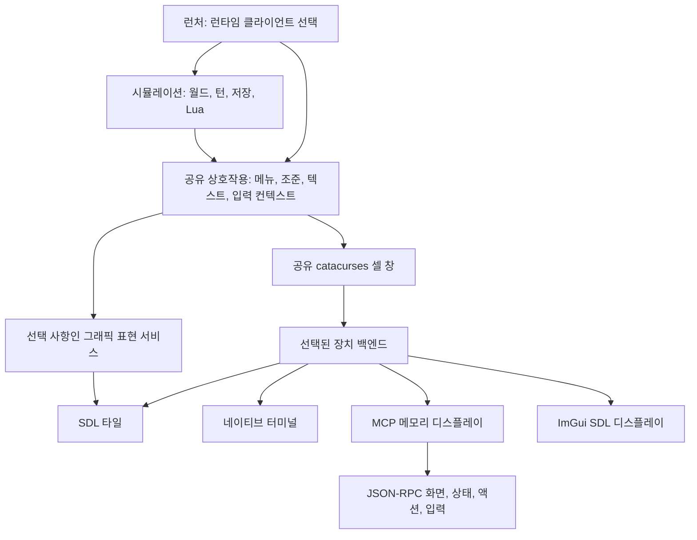

BN은 시뮬레이션과 공유 상호작용 코드를 한 번만 컴파일합니다. 하나의 `cataclysm-bn` 실행 파일이 활성화된 클라이언트를 링크하고 시작할 때 하나를 선택합니다:

```sh
cmake --preset linux-clients
cmake --build --preset linux-clients --target cataclysm-bn
out/build/linux-clients/src/cataclysm-bn --client=tiles
out/build/linux-clients/src/cataclysm-bn --client=curses
out/build/linux-clients/src/cataclysm-bn --client=mcp
```

`TILES`, `CURSES`, `MCP`는 포함할 표준 백엔드를 제어합니다. `IMGUI=ON`은 선택 사항인 Dear ImGui 백엔드를 추가합니다. `--client`는 실행할 백엔드를 선택합니다. 기본 설정은 타일, curses, ImGui, MCP 순으로 우선합니다. 호환 실행 파일 이름은 `--client`로 재정의하지 않는 한 각각 해당하는 클라이언트를 선택합니다.

### ImGui 시험용 클라이언트

선택 사항인 ImGui 클라이언트는 공유 합성 화면을 등록된 액션 및 구조화된 상태 요약과 함께 표시합니다. 타일 UI를 대체하기보다는 백엔드 개발에 사용하기 위한 것입니다.

```sh
cmake --preset linux-clients -DIMGUI=ON
cmake --build --preset linux-clients --target cataclysm-bn-imgui
out/build/linux-clients/src/cataclysm-bn-imgui \
  --userdir out/imgui-profile/ --configdir out/imgui-profile/config/
```

먼저 `--paths`를 추가하고 `Config Directory`가 프로필 안의 경로로 해석되는지 확인하세요. 합성 화면에서 키보드를 사용하거나, 등록된 액션을 선택하거나, 제어 창에 텍스트를 입력할 수 있습니다. 게임이 표시된 입력 경계에서 기다리는 동안에만 컨트롤이 활성화됩니다. ImGui 레이아웃 설정은 저장되지 않습니다.

이 백엔드는 타일 렌더러가 아니라 대체 클라이언트 시험 구현입니다. 합성 화면, 실시간 액션, 텍스트 입력, 간결한 플레이어/인벤토리 보기를 제공하지만 아직 모든 메뉴 선택지, 필드, 대상을 구조화된 위젯으로 제공하지는 않습니다. 구조화 선택지는 이전/다음 컨트롤과 현재 오프셋 및 전체 개수를 표시하는 최대 100개 항목의 페이지로 렌더링됩니다. 수량을 변경해도 현재 페이지를 유지하며, 선택지 스키마가 변경되거나 필터링, 재정렬, 축소되면 렌더링 전에 페이지를 초기화하거나 유효 범위로 조정합니다.

## 의존성 경계



`cataclysm-bn-engine`에는 시뮬레이션과 데이터 처리가 들어 있습니다. `cataclysm-bn-client-common`에는 캐릭터 생성, 인벤토리, 조준, 메뉴, 창 합성, 게임 보기와 같은 공유 상호작용 및 표현 코드가 들어 있습니다. 활성화된 백엔드 수와 관계없이 둘 다 한 번만 컴파일됩니다. 입력 컨텍스트, 선택지, 화면 내용이 공통 상호작용 규약입니다.

이 경계는 프로세스 내부에 있습니다. 게임 플레이 흐름은 공유 상호작용 인터페이스를 통해 선택을 요청할 수 있으며 네이티브 디스플레이나 그 리소스를 소유하지 않습니다. MCP는 이 기존 상호작용 경로에 프로토콜 클라이언트를 추가합니다.

`catacurses::window`의 표현은 하나뿐입니다. UTF-8 셀과 색상을 담는 `cata_cursesport::WINDOW`입니다. 창 생성, 텍스트 배치, 테두리, 커서 상태는 공통 코드입니다. `game_client::backend`는 네이티브 입력, 표현, 터미널 크기, 수명 주기 작업을 제공합니다. ncurses 백엔드는 셀 창을 네이티브 터미널에 투영하고, SDL 백엔드는 맵과 그래픽 창의 타일 렌더링을 유지하며, MCP는 텍스트 표현을 관찰합니다.

`game_client::render_service`에는 클립보드 접근, 글꼴 투영, 클리핑, 확대/축소, 타일셋 관리, 스크린샷 같은 선택적 그래픽 작업이 들어 있습니다. 그래픽 캐릭터/차량 미리보기와 로딩 이미지에는 각각 리소스를 소유하는 구현이 있습니다. 공유 게임 플레이와 메뉴 번역 단위는 SDL 렌더러 타입을 포함하거나 `TILES` 조건으로 두 번째 버전을 컴파일하지 않고 이 인터페이스를 사용합니다. 네이티브 렌더링 구현은 `src/client/tiles/`를 포함한 타일 소스 묶음에 있습니다.

`src/main.cpp`는 인자 처리와 게임 세션 루프를 소유합니다. 네이티브 진입점, 플랫폼 경로, 시그널 처리, SDL 초기화는 `src/platform/`에 있습니다. 백엔드 등록은 명시적이므로 비활성화된 백엔드가 미해결 팩토리 참조를 만들지 않습니다. 옵션 처리 전에 백엔드를 준비하고 로캘과 구성이 준비된 뒤 초기화합니다.

공유 클래스 선언은 모든 대상에서 같은 레이아웃을 가집니다. 네이티브 리소스는 인터페이스 뒤에 두고 소멸자는 소스 파일에서 정의하세요. 클라이언트 빌드 정의는 해당 네이티브 구현 대상에 속합니다.

오디오 재생은 오디오 대상에서 한 번 컴파일됩니다. 음향 전파와 소음이 크리처에 미치는 영향은 엔진에 남습니다. GPU 계산은 디스플레이 선택과 독립적인 시뮬레이션 서비스입니다. Curses와 MCP는 오프스크린 비디오 드라이버를 통해 SDL 계산을 초기화할 수 있습니다. 독립형 CPU 전용 MCP 빌드는 `MCP=ON`, `TILES=OFF`, `CURSES=OFF`, `SOUND=OFF`, `CATA_SDL=OFF`를 사용할 수 있습니다.

## 입력과 관찰

모든 클라이언트는 같은 게임 루프와 `input_context` 로직을 실행합니다. MCP는 키보드, 텍스트, 마우스, 등록된 액션 이벤트를 이 경로로 보냅니다. 활동, 대화, 인벤토리, 캐릭터 생성 중 중첩된 프롬프트도 계속 관찰하고 제어할 수 있습니다.

`game_client::active_input_context()`의 범위는 하나의 입력 요청입니다. 중첩 요청은 반환하거나 예외가 발생할 때 바깥 컨텍스트를 복원합니다. 공유 `client_command` 서비스는 MCP와 독립적으로 액션을 찾고 키보드, 텍스트, 마우스 명령을 해석합니다. 모든 공유 입력 읽기에는 `input_id`가 부여되며, 이전 ID를 가진 명령은 실행 전에 거부됩니다. `game_observation`은 전송 계층이나 렌더러에 의존하지 않고 플레이어에게 보이는 상태를 제공합니다.

입력, 렌더링, 상태 관찰은 게임 스레드에서 실행되므로 안정적인 입력 경계에서 스냅샷을 캡처합니다. `bn.press`는 대기열의 입력이 다음 입력 경계에 도달한 뒤 완료됩니다. 활성 입력 보기에는 폴링 시간 제한이 포함되므로 공유 명령 해석기는 비차단 폴링에서만 `IDLE`을 허용합니다. [입력 기록과 재생](../guides/replay.md)도 각 네이티브 백엔드에 별도 훅을 두지 않고 이 공유 경계를 가로챕니다. 리플레이 기록과 재생은 각 시뮬레이션 호출 경계에서 중단 가능한 활동을 폴링하며, 일반 네이티브 플레이는 실시간 100ms 제한을 유지합니다.

현재 시맨틱 범위는 시작 루트/하위 메뉴, `uilist`, 일반 선택/확인/알림 팝업, `string_input_popup` 필드, 공통 인벤토리 선택기의 필터된 조작 가능 항목, 공통 조준 커서, 공통 방향 프롬프트, 건설을 제공합니다. 스냅샷에는 불투명 ID가 들어 있으며 현재 입력 경계와 스키마에 묶입니다. 선택 상태와 탐색 포커스는 분리됩니다. 인벤토리 다중 선택기는 선택 수량을 선택 상태로 보고하고, 단일 항목 선택기는 닫히기 전 현재 행을 선택된 상태가 아니라 강조 상태로 보고합니다. 인벤토리 단일 선택과 대표적인 버리기, 줍기, 아이템 사용 수량 흐름은 기존 선택기 콜백을 호출하지만 비교 수량은 지원하지 않습니다. 대상 명령은 기존 커서만 이동하며 조준, 발사, 투척, 안전 확인은 등록된 액션과 중첩 프롬프트를 통합니다. 제작법 선택기는 네이티브 제작법 순서, 제작 가능 여부, 필터 흐름, 묶음 상태를 제공하며 확인은 계속 네이티브 재료 및 자격 검사를 사용합니다. 건설은 현재 필터된 프로젝트 순서를 제공하고 네이티브 확인, 인접 배치, 자원, 활동 경로를 사용합니다. 지면 줍기 보기는 필터된 스택, 정확한 충전량 또는 아이템 개수, 부모/자식 상태를 제공하면서 네이티브 토글 전파, 줍기 활동, 착용/장착 검사, 용량 또는 소유권 프롬프트를 유지합니다. 고급 인벤토리는 현재 패널과 포커스 전용 선택을 제공하며, 네이티브 이동 액션은 수량 및 안전 확인 프롬프트를 유지합니다. 대화 응답, 도움말 주제, 읽기 전용 텍스트 보기도 구조화되어 있습니다. `MORALE`은 네이티브 전체 텍스트를 제공하며 시맨틱 취소로 닫힙니다. 차량 상호작용, 캐릭터 생성 및 기타 사용자 지정 보기는 명시적인 `actions_only` 폴백으로 남아 있습니다.

[MCP 가이드](../guides/mcp.md)는 화면, 구조화된 상태, 입력 스키마, 관찰 범위를 설명합니다. 세션 준비 상태는 월드와 캐릭터 설정 뒤 런처가 지정하는 백엔드 중립 플래그입니다. 시작 화면과 캐릭터 생성 중에는 구조화된 상태를 사용할 수 없지만 해당 화면과 입력 컨텍스트는 계속 사용할 수 있습니다.

클라이언트를 추가하려면 장치 인터페이스를 구현하고 팩토리를 등록한 뒤 네이티브 소스를 `CataClientSources.cmake`에 추가하세요. 클라이언트가 지원하는 기능에 대해서만 그래픽 서비스를 제공하세요. 공유 상호작용 코드와 창 표현을 재사용하세요.

## 관련 작업

- [구조화된 상태 및 화면 출력 제안 #9184](https://github.com/cataclysmbn/Cataclysm-BN/issues/9184)는 터미널 스크레이핑의 한계를 설명합니다. MCP는 입력 경계에서 기존 메모리 표면을 캡처하므로 턴뿐 아니라 중첩 프롬프트도 관찰할 수 있습니다.
- [결정적 입력 리플레이 #9478](https://github.com/cataclysmbn/Cataclysm-BN/pull/9478)은 통합 리플레이 기능을 위한 RNG/작업 범위 지정 기반을 제공합니다.
- [헤드리스 curses SDL 초기화](https://github.com/scarf005/Cataclysm-BN/commit/562fa8564091)는 SDL 계산 지원의 디스플레이 요구 사항을 다룹니다. MCP는 자체 메모리 디스플레이 백엔드를 제공합니다.
